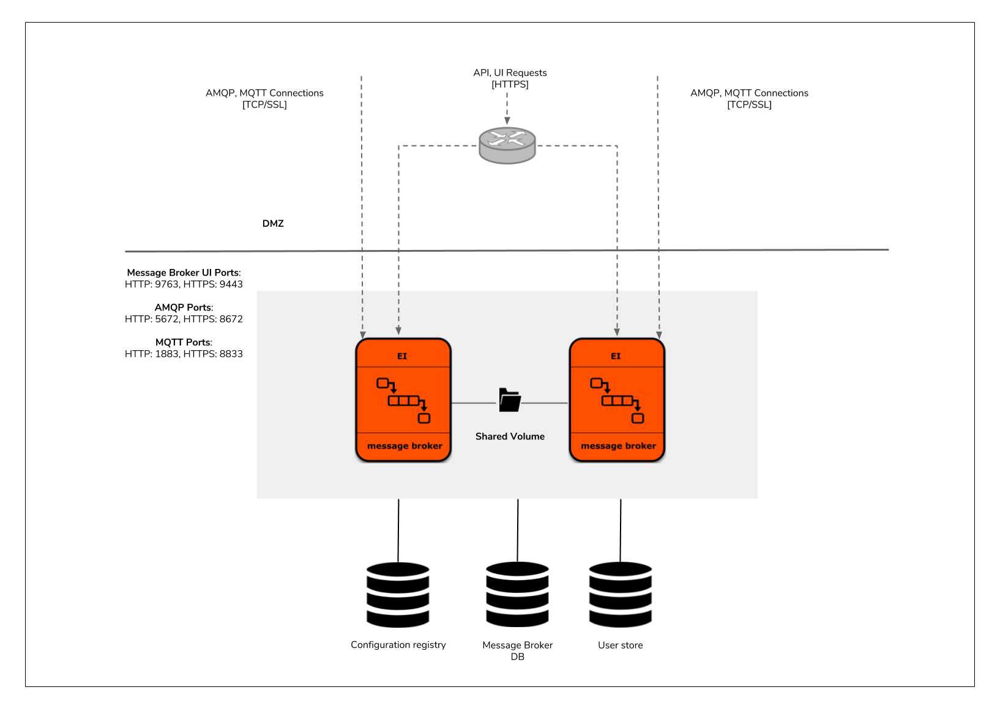
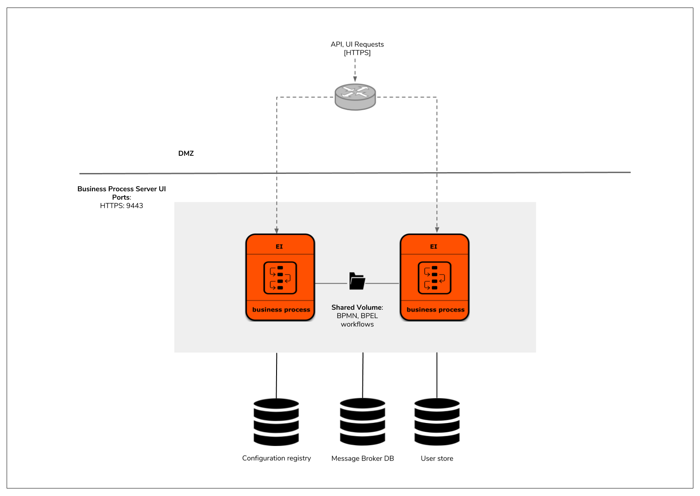
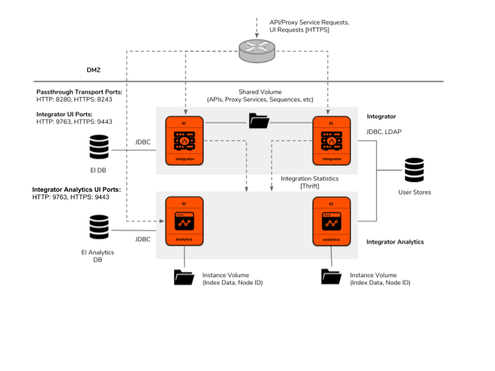

# AWS Resources for WSO2 Enterprise Integrator

This repository contains CloudFormation templates to deploy WSO2 Enterprise Integrator with different patterns in Amazon Web Services(AWS).

## Integrator

## Broker

## Business-Process

## Integrator with Analytics 

