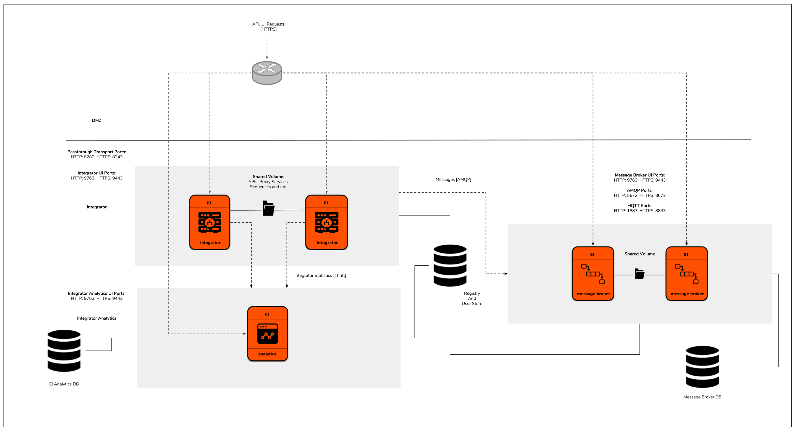

# AWS Resources for WSO2 Enterprise Integrator

This repository contains CloudFormation templates to deploy WSO2 Enterprise Integrator with different patterns in Amazon Web Services(AWS).

The WSO2 EI CloudFormation templates use Puppet to manage the server configurations and use the following AMI's to provision the deployment.

1. Puppetmaster AMI - Contains the Enterprise Integration GA distribution, WSO2 Update Manager and Puppet modules containing the configurations for EI deployment patterns.

2. EI AMI - Includes the product specific resources to create the Puppet catalog.

First the Puppetmaster AMI would deploy and afterwards the product specific AMI's would deploy and request the necessary configurations from the Puppetmaster AMI to deploy the WSO2 Enterprise Integrator.

## Integrator

## Broker

## Business-Process

## Integrator with Analytics

## Integrator, Broker with Analytics

